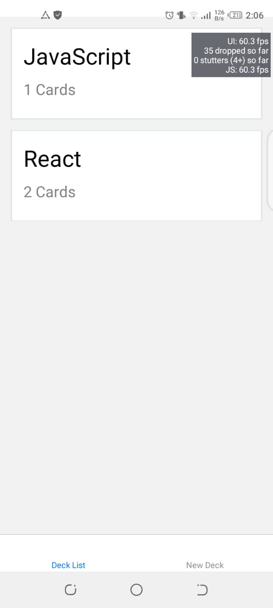
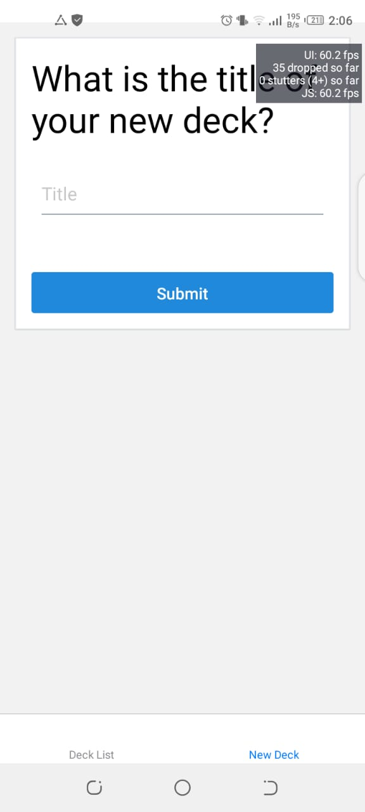
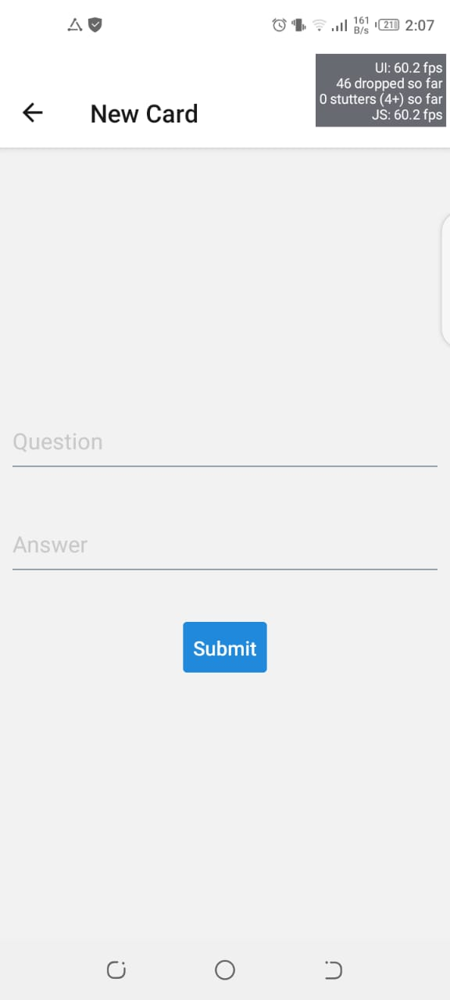
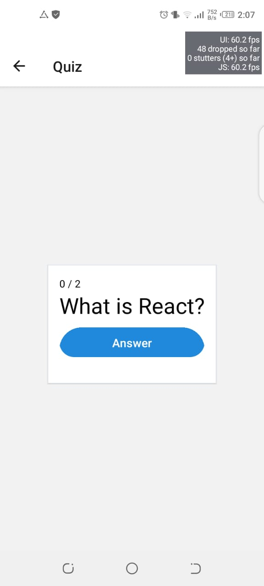
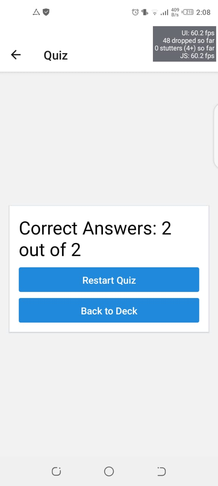

# Mobile-Flashcards

Mobile-Flashcards is a quiz taking app in which there are multiple decks representing any topic and in each deck there are questions which are called cards in the app. 
A user can add a new deck and also can add new cards. A user can start a quiz and after giving the quiz can restart the quiz as well.
This app can be run on both (iOS and andriod) platforms.

# Installation Instructions

Run following commands to start project

* If you are not in the folder then type this command `cd mobile-flashcards`
* install project dependencies with `npm install`
* start development server with `npm start` or `sudo npm start`

## Tested Platform

Tested on Android Platform

# Screen Shots

## Home Screen

## Deck Screen

## Add Card Screen

## Quiz Screen

## Quiz Completed Screen

